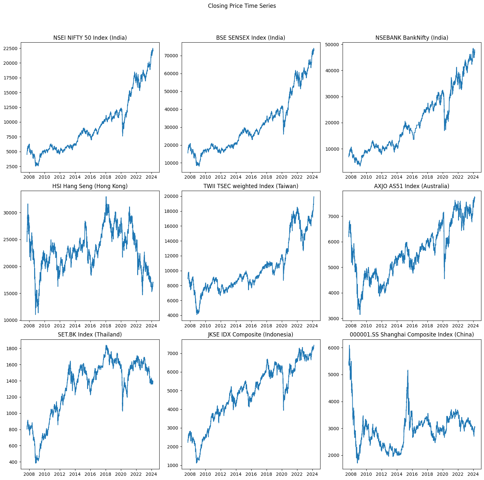

<h2>Introduction</h2>

Our project investigates the complex relationship between market sentiment, derived from Twitter and financial news, and its impact on various global stock market indices. Our goal is to uncover actionable insights for investors and traders to use in their decision-making processes. This insight will help them for Next day market fundamentals.

<h2>Methodology</h2>

1.Stock Market Indices Data:

<ul>
  <li>Gather historical data for various stock market indices. </li>
  <li>This includes indices such as the Dow Jones, European Market, Indian Market, Chinese, Japanese market, Singapore, S&P 500, a others.</li>
  <li>Obtain daily or intraday data (open, close, high, low, volume) for each index.</li>
  
</ul>

2.Twitter Data:

<ul>
  <li>Collect relevant Twitter data related to financial news, comments, and responses.</li>
  <li>Use Twitter APIs or web scraping techniques to retrieve tweets containing relevant keywords (e.g., stock names, market trends, financial terms).</li>
</ul>

3.Data Collection: Gather financial news headlines from reliable sources and preprocess Twitter data.

4.Sentiment Analysis: Apply sentiment analysis to headlines and tweets to determine polarity.

5.Index Sentiment Aggregation: Aggregate sentiment scores for each index from related news and tweets.

6.Correlation Analysis: Compute correlation coefficients between indices and visualize relationships.

7.Impact Prediction: Analyze Twitter data to predict market impact for the next trading day.

8.Statistical Tests and Hypotheses: Validate significance of sentiment scores and correlations using statistical tests.

9.Machine Learning Models (Optional): Train models to predict stock movements based on sentiment and evaluate performance.

10.Reporting and Visualization: Summarize findings in a report and create visualizations for actionable insights.

<h2>Tech Stack</h2>
<ul>
  <li>Python</li>
  <li>Python Lib</li>
  <li>ML Lib</li>
  <li>Colab</li>
  <li>Twitter API</li>
</ul>

<h2>Expected Outcomes:</h2>

Data Collection: Comprehensive historical data for various stock market indices will be gathered, alongside relevant Twitter data related to financial news, comments, and responses, ensuring a diverse range of sentiments is captured.

Sentiment Analysis: Analysis of financial news headlines and Twitter data will unveil prevailing sentiments (positive, negative, or neutral) within the financial community. Calculated sentiment scores for each index based on aggregated tweet sentiment will offer insights into overall market sentiment.

Correlation Analysis: Investigation into the correlation between stock market indices will uncover relationships and dependencies between different markets, facilitating a deeper understanding of global market dynamics.

Impact Prediction: Analysis of Twitter data to predict the market's behavior for the next trading day will provide valuable insights for investors and traders. Exploration of how sentiment trends influence stock market opening and performance will offer actionable information for decision-making.

<h2>Results</h2>

